# Creators Pod — Product Note

> **The Cognitive Operating System for Every Creator on Earth**
> *One platform. Every content format. Every channel. Every persona. Fully autonomous.*

---

## 1. The One-Liner

**Creators Pod doesn't help you create content. It IS your content engine — an autonomous AI platform that remembers everything you've ever created, knows your voice better than you do, predicts what your audience wants before they do, and publishes across 45+ channels while you sleep.**

Jasper gives you a text box. ChatGPT gives you a conversation. Canva gives you a canvas.

**Creators Pod gives you a brain.**

A brain that never forgets. Never sleeps. Never runs out of ideas. And gets smarter every single day.

> *"What if every person on earth — every creator, student, lawyer, shop owner, teacher, solopreneur — had a world-class content team working 24/7, for the cost of a Netflix subscription?"*
>
> **That's Creators Pod.**

---

## 2. Why This Is a Unicorn

### The Market Is Screaming for This

| Signal | Data Point | Source |
|--------|-----------|--------|
| Creator Economy TAM (2024) | **$284 billion** | Freep Press Release |
| Projected Creator Economy TAM (2026) | **>$400 billion** (24% CAGR) | PressConnects |
| SecondBrain AI Ecosystem (2025) | **$12.3 billion** | Maximize Market Research; SNS Insider |
| SecondBrain AI Ecosystem (2035) | **$45.8 billion** (mid-teens CAGR) | Fortune Business Insights |
| AI Content Creation Market (2033) | **$23.5 billion** (27% CAGR) | Grand View Research |
| Vertical Video AI Platforms (2033) | **$9.4 billion** (18.2% CAGR) | Congruence Market Insights |
| Agentic AI Segment (2034) | **$5.2 billion** (30% CAGR) | Market.US |
| Enterprise Knowledge-Mgmt AI (2035) | **$3.0 billion** (15.2% CAGR) | Fortune Business Insights |
| Weekly AI Tool Usage Among Creators | **73%** | Freep |
| Creators Using Autonomous AI Tools | **Only 38%** | Freep |

> [!IMPORTANT]
> **The White Space**: 73% of creators use AI weekly, but only 38% use *autonomous* tools. The high-autonomy, low-cost quadrant of the market is **virtually empty**. Creators Pod is built to own it.

### Three Structural Tailwinds

1. **Cost of content generation → $0.** LLMs and diffusion video models have shifted to production-grade, delivering **40-60% cost reductions** per minute of generated video and sub-second latency for text. End-to-end autonomous pipelines are now technically feasible at scale.
2. **Platform normalization.** TikTok, YouTube, and LinkedIn have already embedded AI features — creators *expect* AI. The gap is ownership, autonomy, and cross-platform orchestration. Global creator earnings exceeded **$300B in 2024**, growing at 12% YoY.
3. **Regulatory moat.** EU AI Act + FTC disclosure rules create compliance burden. Only **12% of existing tools** embed real-time compliance checks (Fortune Business Insights). Builders who embed compliance-first architecture gain trust and lock-in with regulated enterprise clients.
4. **Enterprise KM pressure.** Hybrid workforces have doubled knowledge-base output while cutting headcount, prompting firms to seek **30-40% faster** SOP creation through AI-augmented authoring (World Economic Forum 2025).
5. **Vertical video explosion.** The vertical-video AI platform market expands from $1.9B (2025) to **$9.4B by 2033** (18.2% CAGR) — yet 74% of short-form creators experience latency when stitching AI-generated assets into vertical videos. The infrastructure gap is massive.

---

## 3. The Problem We Solve

### Content Creators Are Drowning

```
😫 IDEA FATIGUE          ⏱️ TIME DRAIN            📉 GUESSWORK
─────────────────────    ─────────────────────    ─────────────────────
Context lost between     Copy-pasting across      Analytics scattered
sessions. No persistent  6 platforms. 4+ hrs/wk   across 6 dashboards.
memory of what worked.   just scheduling.          Strategy = hunches.
```

**Hard Numbers on the Pain:**

- **32%** of creators spend >4 hrs/week *just brainstorming* topics
- **58%** struggle to maintain consistent brand voice across channels
- **68%** cite manual editing as the primary cause of burnout
- **>50%** of independent creators spend their workday *locating prior assets* (Eesel AI survey of 1,200 freelancers)
- **57%** of marketers stitch together 3+ disparate tools to complete a single campaign (Aprimo)
- **54%** of agency leads say lack of cross-platform orchestration is "critical"
- **45%** of G2/Capterra reviewers flag "generic AI output" as a deal-breaker
- **68%** of SaaS founders cite lack of a standardized video-AI API as a barrier (Ability.ai)

> [!NOTE]
> Existing tools (Jasper, Copy.ai, Lumen5) are **assistive**, not **agentic**. They generate text on demand — but they don't remember you, don't learn from performance, don't schedule across platforms, and don't act proactively. Creators Pod does all four.

---

## 4. The Product: What Creators Pod Actually Does

### The Core Idea: Your AI Second Brain

Creators Pod is a **persistent, goal-driven AI co-pilot** that lives alongside every content creator. Unlike chatbot-style AI tools, it:

- **Remembers everything** — past content, performance data, brand voice, audience insights — in a personal knowledge graph (the Second Brain Memory Layer)
- **Acts proactively** — scans trends hourly, generates content on schedule, recommends strategy adjustments based on real data
- **Learns continuously** — every post's performance feeds back into smarter recommendations
- **Creates in every modality** — text, images, video, audio, interactive media, documents
- **Operates across every channel** — social, web, streaming, email, e-commerce, messaging — auto-formatted per platform

---

### 4.1 Content Modalities — Everything Is Content

Creators Pod is modality-agnostic. The platform generates, optimizes, and publishes across **six content modalities**:

| Modality | What the Platform Creates | Key AI Capabilities |
|----------|--------------------------|-------------------|
| **📝 Text** | Scripts, articles, captions, threads, emails, newsletters, product descriptions, press releases, blog posts, landing page copy, ad copy, course outlines, lesson plans, study guides | RAG-powered drafting, brand voice enforcement, SEO optimization, readability scoring, multi-language generation |
| **🖼️ Images** | Social media graphics, thumbnails, infographics, product photos, memes, carousel slides, cover art, presentation visuals, diagrams, mood boards, brand assets | DALL-E / Midjourney / Stable Diffusion integration, auto-resize per platform, brand color & style enforcement, background removal, product mockup generation |
| **🎬 Video** | Short-form vertical (Reels/TikTok/Shorts), long-form horizontal (YouTube), live stream overlays, Stories, product demos, course lectures, animated explainers, video ads, B-roll packages | Script → storyboard → shot list generation, AI voiceover, automated rough-cut assembly, caption/subtitle generation, thumbnail extraction, platform-specific encoding (9:16, 16:9, 1:1) |
| **🎙️ Audio** | Podcasts, voiceovers, audio articles, music beds, sound effects, audiobook chapters, meditation guides, ASMR content, jingles, ad spots | ElevenLabs voice synthesis, multi-speaker podcast generation, transcript → conversational script conversion, audio enhancement, music curation (royalty-free), RSS feed generation |
| **📊 Interactive** | Polls, quizzes, surveys, AR filters, interactive stories, calculators, assessments, live Q&A prompts, gamified content, interactive infographics | Poll/quiz generation from content, engagement-optimized question formats, platform-specific interactive element creation (IG polls, Twitter polls, LinkedIn polls) |
| **📄 Documents** | PDFs, slide decks, whitepapers, research reports, worksheets, printables, eBooks, checklists, templates, invoices, proposals, media kits | Structured document generation with formatting, chart/graph creation, citation management, brand template enforcement, export to PDF/PPTX/DOCX |

> [!IMPORTANT]
> **Every persona uses every modality.** A student creates study flashcards (interactive) AND video explainers. An e-commerce owner creates product photos (images) AND podcast interviews (audio). The platform doesn't restrict — it adapts modality recommendations to each persona's goals.

---

### 4.2 Distribution Channels — Publish Everywhere, Optimize Per Platform

| Channel Category | Platforms | Auto-Format Specs | Key Integration |
|-----------------|-----------|------------------|----------------|
| **Video Social** | YouTube, TikTok, Instagram Reels, YouTube Shorts, Snapchat Spotlight, Facebook Reels | 9:16 vertical, 16:9 horizontal, 1:1 square; platform caption limits; hashtag optimization | Direct API publish, optimal-time scheduling, performance tracking |
| **Image/Text Social** | Instagram Feed/Stories, Twitter/X, LinkedIn, Facebook, Pinterest, Threads, Bluesky, Reddit | Image sizing (1080×1080 IG, 1200×675 Twitter, etc.), caption length optimization, hashtag sets | Multi-platform simultaneous publish, A/B caption testing |
| **Long-Form Web** | Medium, Substack, WordPress, Ghost, personal blogs, Hashnode, Dev.to | SEO-optimized HTML, Open Graph tags, featured images, internal linking suggestions | CMS API integration, scheduled publishing, SEO scoring |
| **Newsletter/Email** | Mailchimp, ConvertKit, Beehiiv, Substack, HubSpot, Brevo (Sendinblue) | HTML email templates, subject line optimization, preview text, mobile-responsive | Subscriber segment targeting, send-time optimization, open rate prediction |
| **Streaming** | Twitch, YouTube Live, Instagram Live, Twitter Spaces, Spotify (podcast), Apple Podcasts, Amazon Music, Google Podcasts | Live overlay graphics, stream alerts, chat moderation prompts, podcast RSS, episode metadata | Stream preparation (titles, descriptions, thumbnails), post-stream clip extraction, podcast distribution |
| **E-commerce** | Shopify, Amazon Seller, Etsy, WooCommerce, Gumroad, Teachable, Patreon | Product descriptions, listing optimization, review response, A+ content | Product photo generation, SEO listing optimization, pricing copy |
| **Professional/Education** | Udemy, Skillshare, Coursera (instructor), LinkedIn Learning, Google Classroom, Canva for Education | Course outlines, lecture scripts, quiz generation, certificate text, syllabus formatting | Curriculum alignment, learning objective mapping, assessment generation |
| **Messaging/Community** | Discord, Slack, WhatsApp Channels, Telegram, Reddit (community management) | Message formatting per platform, community guideline compliance, bot command responses | Automated community engagement, FAQ responses, announcement scheduling |
| **Paid Media** | Meta Ads, Google Ads, LinkedIn Ads, TikTok Ads, Pinterest Ads, Twitter/X Ads | Ad creative specs (dimensions, character limits, CTA formats), A/B variant generation | Campaign asset bundles, performance-optimized creative rotation |

**Total: 45+ platform integrations across 9 channel categories**

---

### 4.3 The Eight Personas — Each With a Dedicated Second Brain Agent

#### Persona 1: Content Creator / Influencer 🎥

| Attribute | Detail |
|-----------|--------|
| **Profile** | Solo YouTuber, TikToker, Instagrammer building personal brand across platforms |
| **Agent Name** | **Growth Scout** |
| **Primary KPI** | Follower growth, engagement rate, sponsorship revenue |
| **Content Modalities** | Video (primary), Images, Text (captions/threads), Audio (podcast clips), Interactive (polls) |
| **Key Channels** | YouTube, TikTok, Instagram, Twitter/X, Pinterest, personal blog |
| **Revenue Model** | Ad revenue, brand sponsorships, affiliate commissions, merchandise, Patreon |
| **Agent Superpower** | Detects trending topics before they peak and creates ready-to-film scripts in your voice |

**Day-in-the-Life:**

| Time | Activity | Agent Action |
|------|----------|-------------|
| **7:00 AM** | Open app, review Daily Brief | Growth Scout auto-generated 3 trending content opportunities with fit scores |
| **7:05 AM** | Tap "Generate" on top pick | Full video script + thumbnail concept + caption variants created in 15 seconds |
| **7:08 AM** | Tweak hook, approve & schedule | Content queued for optimal posting time (2:00 PM); thumbnail auto-generated |
| **11:00 AM** | Film video using generated script | Shot list and B-roll suggestions available in-app |
| **2:00 PM** | Content auto-publishes | TikTok (9:16 clip), YouTube Shorts (vertical), Instagram Reel — all platform-optimized |
| **2:01 PM** | Cross-platform derivatives auto-generate | Twitter thread (8 tweets), Instagram carousel (5 slides), LinkedIn post — queued for approval |
| **6:00 PM** | Check performance notification | "Your video hit 12K views in 4 hours — 340% above your average" |
| **Next AM** | Growth Scout daily report | Performance analysis, strategy adjustments, tomorrow's opportunities |

**Weekly Output: 5-7 published videos + 15-20 derivative posts across 4-5 platforms**
**Weekly Time Investment: ~25 minutes of active platform use**

---

#### Persona 2: Executive / Professional 💼

| Attribute | Detail |
|-----------|--------|
| **Profile** | VP, consultant, academic, thought leader building authority on LinkedIn, Medium, Twitter/X |
| **Agent Name** | **Authority Builder** |
| **Primary KPI** | Network growth, inbound leads, newsletter subscribers, speaking invitations |
| **Content Modalities** | Text (primary — articles, posts, threads), Documents (whitepapers, decks), Audio (podcast appearances), Images (infographics) |
| **Key Channels** | LinkedIn, Medium, Substack, Twitter/X, personal blog, podcast (guest) |
| **Revenue Model** | Consulting fees, speaking engagements, book sales, course revenue, mentoring |
| **Agent Superpower** | Calendar-aware content triggers — detects upcoming events and auto-generates timely commentary |

**Day-in-the-Life:**

| Time | Activity | Agent Action |
|------|----------|-------------|
| **Sunday 9 PM** | 15-min weekly planning session | Authority Builder surfaces 5 content angles tied to this week's calendar events |
| **Monday 8 AM** | Review & approve LinkedIn post | Post auto-generated from upcoming conference topic; 97% voice match |
| **Tuesday** | Zero active time | Authority Builder detects industry report release, drafts commentary post for Wednesday |
| **Wednesday 7 AM** | Quick review of auto-draft | Approve timely commentary → publishes at optimal LinkedIn time (8:30 AM) |
| **Thursday** | Zero active time | Newsletter draft auto-generated from last 4 weeks of published posts + meeting note insights |
| **Friday 5 PM** | Review weekly performance | "Your AI infrastructure post got 2,400 impressions, 68 comments, 3 inbound leads" |
| **End of Month** | 10-min newsletter review | Add one personal anecdote → Substack newsletter publishes to 4,200 subscribers |

**Monthly Output: 10-12 LinkedIn posts, 2-3 articles, 1 newsletter, calendar-triggered commentary**
**Monthly Time Investment: ~90 minutes**

---

#### Persona 3: Agency / Brand 🏢

| Attribute | Detail |
|-----------|--------|
| **Profile** | Marketing team or agency managing multi-brand, multi-channel campaigns |
| **Agent Name** | **Campaign Orchestrator** |
| **Primary KPI** | Campaign ROI, conversion rate, client retention, content velocity |
| **Content Modalities** | All modalities — text, images, video, audio, interactive, documents (reports) |
| **Key Channels** | Meta Ads, Google Ads, LinkedIn, Instagram, TikTok, email, landing pages, client portals |
| **Revenue Model** | Retainer fees, performance commissions, production surcharges |
| **Agent Superpower** | Generate 50+ brand-voice-compliant campaign assets in 20 minutes + continuous performance optimization |

**Day-in-the-Life:**

| Time | Activity | Agent Action |
|------|----------|-------------|
| **Monday AM** | New campaign kickoff | Upload brand guidelines + brief → agent ingests into the Memory Layer, builds campaign context |
| **Monday +20 min** | Asset bundle generated | 10 ad concepts × 2 variations, 15 social posts, 3 email sequences, landing page copy — all brand-voice scored (95%+) |
| **Monday-Tuesday** | Team review in collab workspace | Copywriter edits 2 headlines, art director flags 1 visual → agent regenerates |
| **Wednesday** | Approve & publish | Assets auto-publish to Meta Ads, Google Ads, LinkedIn, Instagram, email platform |
| **Day 3** | Optimization alert | "Ad Set B underperforming (1.2% CTR vs. 2.0% target) — pause? A/B test?" |
| **Day 5** | Auto-A/B test results | "New headline variant increased CTR by 0.8%. Rolling out to full campaign." |
| **Week 4** | Auto-generated client report | White-labeled PDF with narrative insights, data visualizations, ROI analysis |

**Monthly Output per Campaign: 50+ assets, continuous optimization, automated reporting**
**Monthly Time Investment per Campaign: ~140 minutes**

---

#### Persona 4: Student / Young Creator 🎓 *(NEW)*

| Attribute | Detail |
|-----------|--------|
| **Profile** | High school or college student creating study content, building an early personal brand, or producing school projects |
| **Agent Name** | **Study Buddy & Creator Coach** |
| **Primary KPI** | Learning outcomes, portfolio quality, early audience growth, project grades |
| **Content Modalities** | Text (essays, study notes, flashcards), Video (explainers, vlogs, presentations), Images (diagrams, infographics), Interactive (quizzes, flashcards), Documents (reports, slide decks), Audio (study podcasts, recorded lectures) |
| **Key Channels** | TikTok, YouTube, Instagram, Google Classroom, school LMS, Discord, Reddit, personal portfolio site |
| **Revenue Model** | Scholarship portfolio, internship applications, early monetization (Patreon, merch), tutoring |
| **Agent Superpower** | Transforms lecture notes into multi-format study content AND helps build a portfolio/brand simultaneously |

**Day-in-the-Life (School Day):**

| Time | Activity | Agent Action |
|------|----------|-------------|
| **8:00 AM** | Upload lecture notes / textbook photos | Agent extracts key concepts, creates structured study notes |
| **3:30 PM** | After school — generate study materials | Flashcard deck (interactive), concept map (image), 3-min explainer script (video) |
| **4:00 PM** | Record quick explainer video | Agent provides shot list, talking points, on-screen text suggestions |
| **4:15 PM** | Auto-generate derivatives | TikTok explainer (60 sec), Instagram carousel (5 slides), study guide PDF |
| **5:00 PM** | Group study — share quiz | Agent generates 20-question quiz from lecture material → shared to Discord study group |
| **Weekend** | Portfolio building | Agent compiles best content into portfolio site + LinkedIn student profile |
| **Exam Week** | Intensive study mode | Agent creates comprehensive review documents, practice tests, audio summaries for commute listening |

**Weekly Output: 3-5 study content pieces + 2-3 social posts building personal brand**
**Weekly Time Investment: ~30 minutes of active use**

> [!NOTE]
> **Why Students Matter**: Students are tomorrow's Creator Pro subscribers. Free-tier access builds brand loyalty early (the Adobe strategy). With 100M+ students globally using AI for studying, this persona drives massive freemium adoption and creates a pipeline for lifetime value.

---

#### Persona 5: Educator / Course Creator 📚 *(NEW)*

| Attribute | Detail |
|-----------|--------|
| **Profile** | Teacher, professor, online course creator, corporate trainer, EdTech content producer |
| **Agent Name** | **Curriculum Architect** |
| **Primary KPI** | Student engagement, course completion rates, enrollment numbers, content quality scores |
| **Content Modalities** | Video (lectures, tutorials, screen recordings), Documents (syllabi, worksheets, handouts, assessments), Images (diagrams, slides, illustrations), Audio (recorded lectures, narrated slides), Interactive (quizzes, polls, simulations, assessments) |
| **Key Channels** | Udemy, Skillshare, Teachable, YouTube, Google Classroom, Canvas, Moodle, personal course site, Substack (educational newsletter) |
| **Revenue Model** | Course sales, platform royalties, institutional licensing, tutoring, textbook/workbook sales |
| **Agent Superpower** | Transforms raw expertise into complete, multi-format courses — syllabus to final exam — in hours instead of months |

**Day-in-the-Life:**

| Time | Activity | Agent Action |
|------|----------|-------------|
| **Morning** | Upload topic outline for new module | Agent generates: learning objectives, lecture script, slide deck outline, discussion prompts |
| **10:00 AM** | Record lecture using generated script | Teleprompter view with pacing notes, visual cue suggestions |
| **11:00 AM** | Post-recording | Agent auto-generates: captions/subtitles, chapter timestamps, key takeaway summary |
| **Afternoon** | Generate assessment materials | 30-question quiz (MCQ + short answer), practice worksheet, rubric — all aligned to learning objectives |
| **3:00 PM** | Cross-platform distribution | Full lecture → YouTube; 3 micro-lessons (3 min each) → TikTok/Reels; key slides → Instagram carousel; study guide → PDF download |
| **Weekly** | Student engagement analysis | "Module 3 has 40% drop-off at minute 12 — suggest splitting into two shorter lectures" |
| **Monthly** | Newsletter to student community | Auto-curated from latest lectures + supplementary resources + upcoming course announcements |

**Monthly Output: 4-8 lecture modules, 20+ derivative pieces, assessment packages, newsletters**
**Monthly Time Investment: ~8 hours (vs. 40+ hours traditional course creation)**

> [!TIP]
> **EdTech Opportunity**: Only 18% of EdTech influencers use AI for lesson-plan generation despite expressing strong need (DemandGen Report). This persona addresses a $3B+ curriculum-aligned AI content market with almost zero competition.

---

#### Persona 6: E-commerce / Small Business Owner 🛒 *(NEW)*

| Attribute | Detail |
|-----------|--------|
| **Profile** | Shopify store owner, Amazon seller, DTC brand, local business, solopreneur selling products or services |
| **Agent Name** | **Commerce Engine** |
| **Primary KPI** | Sales conversion, ROAS (return on ad spend), customer acquisition cost, repeat purchase rate |
| **Content Modalities** | Images (product photos, lifestyle shots, ad creatives), Text (product descriptions, email campaigns, ad copy, FAQ), Video (product demos, unboxing, testimonials, ads), Documents (catalogs, media kits), Interactive (size guides, product quizzes, configurators) |
| **Key Channels** | Shopify, Amazon, Etsy, Instagram Shopping, TikTok Shop, Facebook Marketplace, Google Shopping, Pinterest, email (Klaviyo/Mailchimp), personal website |
| **Revenue Model** | Product sales, subscriptions, wholesale, affiliate |
| **Agent Superpower** | Generates entire product launch content packages — from listing to ad creative to email sequence — in minutes |

**Day-in-the-Life:**

| Time | Activity | Agent Action |
|------|----------|-------------|
| **Morning** | Upload 3 raw product photos | Agent generates: white background product shots, lifestyle mockups, Instagram-ready graphics, size comparison images |
| **9:30 AM** | Generate product listing | SEO-optimized title, bullet points, description, A+ content — tailored per platform (Amazon vs. Shopify vs. Etsy) |
| **10:00 AM** | Launch ad campaign | Agent creates: 5 ad creatives (image + video), 3 headline variants, 2 audience targeting suggestions, A/B test plan |
| **Noon** | Email sequence for launch | 4-email series: teaser → launch → social proof → last chance — with subject line predictions |
| **Afternoon** | Social content batch | 10 social posts (product features, customer reviews, behind-the-scenes, how-to-use) scheduled across IG, TikTok, Pinterest |
| **End of Week** | Performance review | "Ad Set 2 has 3.4× ROAS — recommend increasing budget. Email sequence has 42% open rate — above industry avg." |
| **Monthly** | Seasonal campaign prep | Holiday-themed content package, gift guide, discount landing page copy, retargeting ad creatives |

**Weekly Output: 30+ product content assets, active ad campaigns, email sequences**
**Weekly Time Investment: ~2 hours**

---

#### Persona 7: Podcaster / Audio Creator 🎙️ *(NEW)*

| Attribute | Detail |
|-----------|--------|
| **Profile** | Podcast host, audio content creator, audiobook narrator, music producer creating companion content, ASMR creator |
| **Agent Name** | **Audio Amplifier** |
| **Primary KPI** | Downloads per episode, subscriber growth, listener retention, sponsorship revenue |
| **Content Modalities** | Audio (primary — podcasts, voiceovers, audio articles), Video (video podcasts, clip highlights, audiograms), Text (show notes, transcripts, blog posts from episodes), Images (cover art, episode graphics, audiograms), Documents (media kits, sponsorship decks) |
| **Key Channels** | Spotify, Apple Podcasts, YouTube (video podcast), Amazon Music, Google Podcasts, Overcast, personal website, Patreon, Substack (companion newsletter), social media (clips) |
| **Revenue Model** | Sponsorships, premium subscriptions (Patreon), live events, merchandise, course sales |
| **Agent Superpower** | One recording → full podcast episode + 15 derivative content pieces across all platforms |

**Day-in-the-Life (Recording Day):**

| Time | Activity | Agent Action |
|------|----------|-------------|
| **Pre-recording** | Episode prep | Agent generates: research brief on topic, guest background summary, 15 interview questions, talking points outline |
| **Recording** | Record 60-min episode | Live transcription, key moment flagging, topic segmentation |
| **Post-recording** | Upload raw audio | Agent processes: noise reduction, level normalization, automatic chapter markers, silence trimming |
| **+30 min** | Full package generated | Edited episode + show notes + full transcript + 5 highlight clips (60-90 sec each) + audiogram videos + blog post from transcript + newsletter with key takeaways |
| **Distribution** | One-click multi-platform publish | Spotify, Apple Podcasts, YouTube (video podcast w/ waveform), Amazon Music — all with optimized metadata and episode descriptions |
| **Social promotion** | Auto-scheduled across week | 5 video clips → TikTok/Reels/Shorts; pull quotes → Twitter/LinkedIn; key insight → newsletter |
| **Next week** | Performance insights | "Episode 47 had 23% higher retention than average — the guest interview format works. Suggest more guest episodes." |

**Weekly Output per Episode: 1 full podcast + 15-20 derivative content pieces**
**Weekly Time Investment: Recording time + ~20 minutes of review**

---

#### Persona 8: Journalist / Writer / Blogger ✍️ *(NEW)*

| Attribute | Detail |
|-----------|--------|
| **Profile** | Freelance journalist, staff reporter, independent blogger, newsletter writer, non-fiction author, investigative reporter |
| **Agent Name** | **Story Engine** |
| **Primary KPI** | Article readership, newsletter subscriber growth, syndication reach, source quality, investigative depth |
| **Content Modalities** | Text (primary — articles, investigations, newsletters, pitches, press releases), Documents (research reports, source dossiers, FOIA templates), Images (data visualizations, infographics, hero images), Audio (interview transcription, audio articles), Video (documentary clips, explainers) |
| **Key Channels** | Medium, Substack, personal blog, WordPress, news outlets (pitch/syndication), Twitter/X, LinkedIn, podcast (companion), YouTube (documentary content) |
| **Revenue Model** | Freelance fees, newsletter subscriptions, syndication licensing, book advances, grants, Patreon |
| **Agent Superpower** | Deep research with source verification, fact-checking with provenance tracking, and transparent audit trails for editorial integrity |

**Day-in-the-Life:**

| Time | Activity | Agent Action |
|------|----------|-------------|
| **Morning** | Start new investigation/article | Agent runs Deep Research Workflow: scrapes 20+ sources, extracts key data, verifies statistics, flags contradictions |
| **10:00 AM** | Review research brief | 5,000-word research report with citations, source credibility scores, data visualization suggestions |
| **11:00 AM** | Interview transcription | Upload 45-min interview audio → full transcript + key quote extraction + fact-checkable claims highlighted |
| **Afternoon** | Draft article | RAG-powered drafting from research brief + interview + notes; article maintains journalist's narrative style (voice score: 96%) |
| **3:00 PM** | Fact-check pass | Agent scans draft: verifies all statistics against primary sources, flags any unverified claims, generates citation footnotes |
| **4:00 PM** | Publish + distribute | Article → Substack newsletter + Medium cross-post; key findings → Twitter thread; data viz → LinkedIn post |
| **Weekly** | Newsletter curation | Auto-generated weekly roundup: 3-5 stories covered, reading recommendations, subscriber Q&A |
| **Monthly** | Pitch generation | Agent identifies trending editorial opportunities, generates 5 pitch emails to target publications |

**Monthly Output: 8-12 articles, 4 newsletters, 20+ social posts, 5 pitches**
**Monthly Time Investment: Focused on actual reporting and writing — platform overhead near zero**

> [!WARNING]
> **Investigative journalism demands provenance.** The Compliance-Aware Generation system (Patent #8) provides an audit trail for every AI-assisted research step — critical for editorial integrity and a key differentiator in the $4B AI-enabled investigative tools market identified in Research 2.

---

#### Persona 9: Solopreneur / Freelancer 🚀 *(NEW)*

| Attribute | Detail |
|-----------|--------|
| **Profile** | One-person business: coach, consultant, freelance designer, virtual assistant, fitness trainer, nutritionist, life coach, financial advisor |
| **Agent Name** | **Business Amplifier** |
| **Primary KPI** | Inbound leads, client bookings, revenue, email list growth, authority perception |
| **Content Modalities** | Text (blog posts, social captions, email sequences, proposals, case studies), Images (social graphics, service showcases, testimonials), Video (explainers, client testimonials, webinar replays, Reels), Documents (proposals, case studies, media kits, invoices), Audio (podcast guest pitches, audio testimonials) |
| **Key Channels** | Instagram, LinkedIn, Twitter/X, TikTok, personal website/blog, email (ConvertKit/Mailchimp), YouTube, Google Business Profile, Calendly landing pages |
| **Revenue Model** | Service fees, retainers, coaching packages, digital products, affiliate income |
| **Agent Superpower** | Turns expertise into a self-running content marketing machine — blog + email + social + lead magnet — without hiring a marketer |

**Day-in-the-Life:**

| Time | Activity | Agent Action |
|------|----------|-------------|
| **7:00 AM** | Morning brief | Agent surfaces: 2 content ideas from trending topics in your niche, 1 client success story to repurpose, 1 email campaign due |
| **7:10 AM** | Approve content batch | 3 Instagram posts, 2 LinkedIn posts, 1 blog article — all pre-generated in your voice, scheduled for the week |
| **9:00 AM** | Client session ends | Upload session notes → agent auto-generates: case study draft, testimonial request email, social proof post |
| **Noon** | Lead magnet creation | Agent creates: PDF guide ("5 Steps to X") from your blog posts + landing page copy + email nurture sequence (5 emails) |
| **3:00 PM** | Podcast guest pitch | Agent identifies 10 relevant podcasts, generates personalized pitch emails with talking point suggestions |
| **Weekly** | Performance review | "Your LinkedIn posts drove 14 profile views → 3 discovery call bookings this week. Best performing topic: client transformation stories." |
| **Monthly** | Newsletter + content calendar | Auto-generated monthly newsletter + next month's content calendar pre-populated with seasonal topics |

**Monthly Output: 20+ social posts, 4 blog articles, 4 email campaigns, lead magnets, proposals**
**Monthly Time Investment: ~2 hours**

> [!NOTE]
> **Why Solopreneurs Matter**: There are **582 million entrepreneurs** globally (GEM Report). Most have zero marketing budget and no content team. A $29/month platform that replaces a $3,000/month marketing freelancer is an instant yes. This is the highest-volume persona.

---

#### Persona 10: SME / Small Business Team 🏪 *(NEW)*

| Attribute | Detail |
|-----------|--------|
| **Profile** | Small or medium enterprise (5-50 employees) with a small marketing team (1-3 people) needing to scale content output beyond their headcount |
| **Agent Name** | **Growth Partner** |
| **Primary KPI** | Brand awareness, lead generation, website traffic, customer acquisition, content velocity vs. team size |
| **Content Modalities** | All modalities — text (blog, social, PR, internal comms), images (social, ads, website), video (product demos, company culture, testimonials), documents (whitepapers, reports, proposals, internal docs), email (campaigns, drip sequences, onboarding) |
| **Key Channels** | LinkedIn (company page), Instagram, Facebook, Twitter/X, company blog/website, email, Google Ads, YouTube, industry publications, press release distribution |
| **Revenue Model** | Product/service sales, B2B contracts, SaaS subscriptions |
| **Agent Superpower** | Gives a 2-person marketing team the output of a 10-person team — consistent multi-channel presence without hiring |

**Day-in-the-Life (Marketing Manager at 30-person SaaS company):**

| Time | Activity | Agent Action |
|------|----------|-------------|
| **Monday AM** | Weekly content planning | Agent generates: 5 blog topics (SEO-scored), 15 social posts, 2 email campaigns, 1 press release draft — all brand-voice aligned |
| **Monday PM** | Team review | Marketing manager + designer review in collab workspace; approve 80%, tweak 20% |
| **Tuesday** | Content auto-publishes | Blog → company website; social → LinkedIn, Twitter, Instagram; email → HubSpot drip |
| **Wednesday** | PR opportunity detected | Agent identifies industry news → auto-generates expert commentary PR pitch for 5 journalists |
| **Thursday** | Sales enablement | Agent creates: customer case study, updated product one-pager, competitive comparison doc |
| **Friday** | Weekly analytics | "Website traffic up 23% WoW; LinkedIn company page reached 12K impressions; 8 MQLs from blog content" |
| **Monthly** | Quarterly report prep | Auto-generated marketing performance report for leadership: ROI analysis, channel performance, content portfolio breakdown |

**Monthly Output: 60+ pieces of content across all channels — without additional hires**
**Monthly Time Investment: ~8 hours total for marketing team**

---

#### Persona 11: Service Professional 🔧 *(NEW)*

| Attribute | Detail |
|-----------|--------|
| **Profile** | Plumber, electrician, lawyer, accountant, dentist, real estate agent, personal trainer, hair stylist, chiropractor, interior designer — any service provider who needs local marketing and client engagement |
| **Agent Name** | **Local Authority** |
| **Primary KPI** | Local search visibility, appointment bookings, Google reviews, referral rate, client retention |
| **Content Modalities** | Video (before/after showcases, how-to tips, client testimonials, behind-the-scenes), Images (project photos, before/after, team photos, infographics), Text (Google Business posts, social captions, blog articles, FAQ answers, review responses), Documents (service guides, pricing sheets, client handouts) |
| **Key Channels** | Google Business Profile, Instagram, Facebook, TikTok, Nextdoor, Yelp, personal website, email (appointment reminders + newsletters), YouTube (how-to), local directories |
| **Revenue Model** | Service fees, recurring appointments, referrals, upselling premium services |
| **Agent Superpower** | Turns every job into content — snap a photo of finished work, get 10 pieces of marketing content back instantly |

**Day-in-the-Life (Plumber / Electrician / Lawyer):**

| Time | Activity | Agent Action |
|------|----------|-------------|
| **After each job** | Snap a photo of completed work | Agent generates: before/after post, Google Business update, Instagram Reel script, client testimonial request, how-to tip related to the job |
| **Morning commute** | Voice memo: "Installed a tankless water heater today, client saved 30% on bills" | Agent converts to: blog post (SEO: "tankless water heater benefits"), TikTok script, email newsletter tip, Google Business Q&A |
| **Lunch break** | Review & approve batch | 5 social posts + 1 blog article + 2 Google Business updates ready for the week |
| **Saturday** | Review request campaign | Agent auto-sends personalized review request emails to this week's clients with direct Google review links |
| **Monthly** | Local SEO report | "Your Google Business profile was viewed 2,400 times. 12 calls from Google. 6 new 5-star reviews. Ranking #3 for 'plumber near me'." |
| **Seasonal** | Campaign prep | Winter: "Frozen pipe prevention" content package. Tax season (lawyer/accountant): "Filing deadline" campaign. Wedding season (photographer): "Booking now" campaign |

**Monthly Output: 15-20 social posts, 2-3 blog articles, Google Business updates, review campaigns**
**Monthly Time Investment: ~30 minutes per week**

> [!TIP]
> **Why Service Professionals Matter**: There are **33 million small businesses** in the US alone, and **76% say they don't have time for marketing** (SCORE Report). A plumber who snaps a photo of a finished job and gets 10 pieces of content back — *that's magic*. This is the persona that drives word-of-mouth viral growth.

---

#### Persona 12: Product Creator / Publisher 📖 *(NEW)*

| Attribute | Detail |
|-----------|--------|
| **Profile** | Self-published author, children's book creator, coloring book designer, printable/template maker, merch designer, digital product creator (eBooks, planners, journals, sticker packs, wallpapers), Etsy/Amazon KDP seller |
| **Agent Name** | **Creative Publisher** |
| **Primary KPI** | Product sales, marketplace ranking, review count, catalog size, production velocity |
| **Content Modalities** | Images (illustrations, cover designs, interior pages, product mockups, marketing visuals), Text (book content, product descriptions, keywords, marketing copy, press releases), Video (book trailers, product previews, unboxing, process videos), Documents (book interiors, printable layouts, PDF products, media kits), Audio (audiobook narration, read-aloud clips), Interactive (coloring page previews, sample chapters) |
| **Key Channels** | Amazon KDP, Etsy, Gumroad, Shopify, Instagram, TikTok (#BookTok), Pinterest, personal website, email, Facebook Groups, BookBub, Goodreads |
| **Revenue Model** | Product sales (books, printables, digital downloads), royalties, licensing, bulk/wholesale |
| **Agent Superpower** | End-to-end product creation — from concept to published and marketed product — across books, printables, coloring books, and digital goods |

**Day-in-the-Life (Children's Book Creator / Coloring Book Designer):**

| Time | Activity | Agent Action |
|------|----------|-------------|
| **Morning** | Concept ideation | Agent generates: 5 children's book concepts with cover sketch descriptions, character summaries, and age-appropriate themes based on trending Amazon KDP categories |
| **9:00 AM** | Select concept, generate content | Full book outline → 12-page story text → illustration descriptions per page → cover description → back cover blurb |
| **10:00 AM** | Illustration generation | Agent creates: 12 interior illustrations + front cover + back cover art in consistent visual style |
| **11:00 AM** | Coloring book page batch | Agent generates: 20 coloring book pages (line-art style, age-appropriate complexity), formatted for 8.5×11 print |
| **Afternoon** | Product listing prep | Amazon KDP metadata (title, subtitle, 7 keywords, 5 bullet points, description — all SEO-optimized), ISBN assignment guidance, category selection |
| **2:00 PM** | Marketing content | Book trailer video (animated stills + voiceover), Instagram carousel (sneak peek pages), TikTok #BookTok script, Pinterest pins (5 with different hooks), email blast to subscriber list |
| **Weekly** | Product portfolio expansion | Agent suggests: "Your dinosaur coloring book sells 40 units/week — create a companion activity book and dinosaur facts book to cross-sell" |
| **Monthly** | Sales analytics | "3 books published this month. Total portfolio: 28 products. Best seller: 'Jungle Adventures Coloring Book' (142 units). Recommend: bundle pricing, A+ content upgrade." |

**Monthly Output: 2-4 complete products (books/printables) + full marketing packages for each**
**Monthly Time Investment: ~10 hours (vs. 80+ hours traditional publishing workflow)**

> [!IMPORTANT]
> **Why Product Creators Matter**: Amazon KDP alone had **$1.7B in creator payouts** in 2024. The coloring book market is $750M+ and growing. Low-content and medium-content books (journals, planners, activity books) are a massive, repeatable product category. Creators Pod can **10× production velocity** while maintaining artistic consistency across a product catalog.

---

### 4.4 Persona-Agent Summary Matrix

| Persona | Agent Name | Primary Modalities | Primary Channels | Key Daily Agent Tasks | Autonomy Level |
|---------|-----------|-------------------|-----------------|----------------------|---------------|
| **Content Creator** | Growth Scout | Video, Images, Text | YouTube, TikTok, Instagram, Twitter | Trend monitoring, script generation, cross-platform publishing, performance analysis | Medium — supervised scheduling |
| **Executive** | Authority Builder | Text, Documents, Images | LinkedIn, Medium, Substack, Twitter | Calendar-triggered content, thought leadership drafting, network growth tracking, compliance checking | High — autopilot with approval gates |
| **Agency** | Campaign Orchestrator | All modalities | Meta Ads, Google Ads, LinkedIn, Instagram, Email | Campaign asset generation, brand voice enforcement, A/B testing, optimization alerts, client reporting | Configurable per campaign |
| **Student** | Study Buddy & Creator Coach | Text, Interactive, Video, Images | TikTok, YouTube, Discord, Google Classroom | Study material generation, flashcard creation, quiz generation, portfolio building | High — autopilot for study, supervised for social |
| **Educator** | Curriculum Architect | Video, Documents, Interactive, Images | Udemy, YouTube, Google Classroom, Substack | Lecture script generation, assessment creation, curriculum alignment, student engagement analysis | Medium — approval for published courses |
| **E-commerce** | Commerce Engine | Images, Text, Video, Documents | Shopify, Amazon, Instagram, Email, Google Ads | Product listing optimization, ad creative generation, email sequences, seasonal campaigns | High — autopilot for listings, supervised for ads |
| **Podcaster** | Audio Amplifier | Audio, Video, Text, Images | Spotify, Apple Podcasts, YouTube, Social | Episode processing, show notes, transcript, clip extraction, multi-platform distribution | High — autopilot for derivatives |
| **Journalist** | Story Engine | Text, Documents, Images, Audio | Substack, Medium, WordPress, Twitter, LinkedIn | Deep research, source verification, fact-checking, draft generation, pitch creation | Low — human-in-the-loop for editorial integrity |
| **Solopreneur** | Business Amplifier | Text, Images, Video, Documents | LinkedIn, Instagram, Email, Website, YouTube | Lead magnet creation, email sequences, social batching, case studies, podcast pitching | High — autopilot for marketing, supervised for proposals |
| **SME Team** | Growth Partner | All modalities | LinkedIn, Website, Email, Google Ads, YouTube | Blog + social + PR generation, sales enablement, quarterly reporting, multi-channel campaigns | Medium — team approval workflow |
| **Service Professional** | Local Authority | Video, Images, Text | Google Business, Instagram, Facebook, TikTok, Nextdoor | Job-to-content conversion, review campaigns, local SEO, seasonal marketing | High — snap photo → content autopilot |
| **Product Creator** | Creative Publisher | Images, Text, Documents, Video | Amazon KDP, Etsy, Gumroad, Instagram, TikTok, Pinterest | Product generation, listing optimization, catalog expansion, book/printable marketing | Medium — approval for published products |

---

## 5. Key Features & Value Delivery

### The 15 Platform Capabilities

#### 🧠 1. Persistent Memory (Second Brain Memory Layer)

Personal knowledge graph stores every idea, draft, performance metric, brand guideline, conversation, source, and audience insight — *forever*. Zero context loss between sessions.

**Value by Persona:**
- **Creator**: "Remember which hooks performed best last quarter and evolve my style"
- **Executive**: "Index my meeting notes and surface publishable insights automatically"
- **Student**: "Build a cumulative knowledge base across all my courses — searchable forever"
- **E-commerce**: "Track which product descriptions and ad copy drove the most sales"
- **Journalist**: "Maintain a connected source database across all investigations"

---

#### 🎨 2. Brand Voice DNA

Proprietary voice fingerprint technology analyzes your past content to build a multi-dimensional tone/style profile. Every AI-generated piece is scored against this fingerprint (target: 90%+ alignment). Dynamic drift detection lets the fingerprint evolve as your style naturally shifts.

**Value by Persona:**
- **Creator**: "Content sounds like ME — my audience can't tell AI helped" (94%+ alignment)
- **Agency**: "Enforce consistent brand voice across 20 freelancers working on the same client"
- **Executive**: "Professional, not generic — matches my specific communication style"
- **Educator**: "Maintain my teaching tone — approachable yet authoritative"
- **Podcaster**: "Show notes and social posts match my conversational podcast voice"

---

#### 🤖 3. 120+ Specialized AI Agents

Not one generalist AI — a **team of 120+ specialist agents**, each masterful at a single task:

| Category | Agent Examples | Count |
|----------|--------------|-------|
| **Content Creation & Writing** | Script Writer, Caption Generator, Hook Creator, Thread Writer, Essay Outliner, Pitch Drafter, Product Description Writer, Course Script Agent, Interview Prep Agent | 12 |
| **Content Optimization** | SEO Optimizer, Tone Shifter, Engagement Predictor, Controversy Detector, Readability Enhancer, Clarity Scorer, Length Adjuster, Emotional Resonance Agent | 10 |
| **Visual & Image** | Image Generator, Thumbnail Creator, Product Photo Agent, Infographic Designer, Carousel Maker, Meme Generator, Cover Art Agent, Diagram Builder, Brand Asset Generator, Background Remover | 12 |
| **Video Production** | Storyboard Agent, Video Script Agent, Caption/Subtitle Agent, B-Roll Suggester, Audiogram Creator, Video Clip Extractor, Intro/Outro Generator, Screen Recording Editor | 10 |
| **Audio & Podcast** | Podcast Script Agent, Audio Enhancer, Transcript Agent, Show Notes Generator, Music Curation Agent, Voiceover Agent, Audio Article Agent, Episode Chapter Agent | 10 |
| **Research & Intelligence** | Deep Research Agent, Competitor Analysis, Keyword Research, Fact Checker, Citation Generator, Source Validator, Statistics Finder, Audience Insight Agent, Sponsorship Scout, Content Gap Analyzer | 12 |
| **Analytics & Performance** | Growth Forecaster, Sentiment Analyzer, ROI Calculator, Churn Predictor, Engagement Analyzer, Benchmark Comparison, Viral Potential Scorer, Attribution Tracker, A/B Test Analyzer | 10 |
| **Platform-Specific** | YouTube SEO, TikTok Trend, LinkedIn Algorithm, Instagram Grid Planner, Pinterest Optimizer, Shopify Listing Agent, Amazon SEO Agent, Podcast Distribution Agent, Email Deliverability Agent, Google Ads Copy Agent | 12 |
| **Education & Learning** | Quiz Generator, Flashcard Creator, Lesson Plan Agent, Learning Objective Writer, Assessment Rubric Agent, Curriculum Mapper, Study Guide Agent, Student Engagement Analyzer | 10 |
| **Collaboration & Workflow** | Feedback Synthesizer, Approval Router, Deadline Manager, Client Reporter, Version Comparator, Asset Organizer, Task Prioritizer, Team Assignment Agent | 10 |
| **Advanced & Specialized** | Translation Agent (20+ languages), Plagiarism Detector, Legal Review, Crisis Response, Accessibility Checker, Archive Organizer, Seasonal Content Agent, Trend Predictor | 10 |
| **Core System Agents** | Trend Monitor, Brand Voice Enforcer, Compliance Engine, Publishing Scheduler, Performance Analytics, Calendar Trigger, Notification Manager, Workflow Orchestrator | 8 |

**Total: 126 Specialized Agents across 12 categories**

---

#### 🔄 4. Multi-Agent Workflows

One-click, multi-step agent sequences for complex tasks. Each workflow chains 3-6 specialist agents:

| Workflow | Input | Output | Agents Chained | Time |
|----------|-------|--------|---------------|------|
| **Deep Research Report** | Topic + desired depth | 5,000-word cited report with data visualizations | Research → Fact Check → Content → Formatting | 8 min |
| **Blog → Podcast** | Blog post URL | Full podcast script + AI voiceover + show notes + episode art | Content → Audio Script → Voiceover → Audio Enhance → Show Notes | 5 min |
| **Cross-Platform Repurposer** | 1 YouTube video | 10+ derivatives: TikTok clips, Twitter thread, LinkedIn article, newsletter segment, Instagram carousel, blog post, audio clip | Transcript → Decomposition → Multi-Format → Platform Optimize → Scheduling | 12 min |
| **Campaign Asset Bundle** | Campaign brief + brand guidelines | 50+ assets: ads, social posts, emails, landing page copy | Brand Voice → Content Gen → Image Gen → Compliance → Format | 20 min |
| **Course Creator** | Topic outline + learning objectives | Full course module: lecture script, slides, quiz, worksheet, summary | Curriculum Map → Script → Visual → Assessment → Format | 15 min |
| **Product Launch Package** | Product photos + features | Listings, ad creatives, email sequence, social posts, product video script | Product Describe → Image Enhance → Ad Creative → Email → Social | 10 min |
| **Podcast → Everything** | Raw audio file | Edited episode, transcript, show notes, 5 video clips, blog post, newsletter, social posts | Transcribe → Edit → Show Notes → Clip Extract → Blog Convert → Social | 8 min |
| **Newsletter Generator** | Theme OR "auto-curate from last 30 days" | HTML newsletter with intro, 3-5 sections, CTA, preview text | Research → Content → Email Format → Subject Line → Preview | 5 min |
| **Viral Trend Response** | Trending topic alert | Ready-to-publish response content in your voice | Trend Detect → Angle Generate → Script → Visual → Schedule | 5 min |
| **Investigation Workflow** | Research question + initial sources | Research dossier with verified facts, source credibility, data viz, draft article | Deep Research → Source Validate → Fact Check → Draft → Compliance | 15 min |
| **Study Sprint** | Lecture notes / textbook chapter | Flashcards, concept map, practice quiz, audio summary, explainer script | Extract → Organize → Quiz Gen → Audio Summary → Visual | 6 min |
| **Localization & Translation** | Source content + target languages | Culturally adapted translations in 20+ languages | Translate → Cultural Adapt → Platform Format → Quality Check | 4 min/lang |

---

#### 📊 5. Unified Analytics Dashboard

All platform metrics across **every connected channel** in one real-time view:

- **Cross-Platform Metrics**: Total reach, engagement rate, follower growth, click-through rate — aggregated and per-platform
- **Content Performance**: Top performers, underperformers, pattern extraction (what format/topic/time works best)
- **Revenue Tracking**: Ad revenue, sponsorship value, course sales, product sales — tied to content that drove them
- **Audience Intelligence**: Demographics, interests, active times, platform overlap, growth trajectory
- **Agent Activity**: How many tasks ran, time saved, content generated, publishing cadence
- **Goal Progress**: Visual progress bars toward stated objectives with projected completion dates
- **Competitor Benchmarking**: How your metrics stack up against similar creators in your niche

---

#### 🔥 6. Proactive Trend Monitoring

Scans **12+ trend sources** every 2 hours:

| Source | Signal Type |
|--------|-----------|
| TikTok Discover | Trending sounds, hashtags, formats |
| YouTube Trending | Viral topics, rising creators, format trends |
| Twitter/X Trending | Real-time conversation spikes, hashtags |
| Reddit Hot & Rising | Niche community discussions, emerging topics |
| Google Trends | Search interest spikes, regional trends |
| Instagram Explore | Visual trends, Reels patterns, aesthetic shifts |
| Pinterest Trends | Long-tail visual trends (3-6 month cycles) |
| Spotify Charts | Audio trends, podcast topic popularity |
| Industry News RSS | Sector-specific news for executive/journalist personas |
| Academic/Research feeds | New studies, data releases (for educator/journalist) |
| E-commerce trends | Product category trends, seasonal demand signals |
| Competitor activity | What similar accounts are publishing and how it's performing |

Each trend is scored with a personalized **fit score** = (niche relevance × audience overlap × historical performance correlation × timeliness urgency).

---

#### 📅 7. Calendar-Aware Content Triggers

Syncs with Google Calendar, Outlook, school calendars, industry event calendars, and e-commerce seasonal calendars:

- **Executive**: Detects conferences, earnings calls, product launches → auto-generates timely commentary 3 days before
- **Educator**: Detects exam periods, semester starts, school events → auto-generates relevant content
- **E-commerce**: Detects Black Friday, holiday seasons, product launches → pre-generates campaign content
- **Creator**: Detects collaboration dates, brand partnership deadlines, personal milestones
- **Journalist**: Detects court dates, report releases, policy deadlines → prepares research briefs

---

#### 🛡️ 8. Compliance & Safety Engine

Multi-layer compliance scanning on **every generation cycle**:

| Check Type | What It Catches | Who Needs It Most |
|-----------|----------------|------------------|
| **Confidential Data Scan** | Financial data, code names, internal metrics, PII | Executive, Agency |
| **FTC Disclosure** | Sponsorship disclosure requirements, affiliate link rules | Creator, Agency |
| **EU AI Act Labeling** | AI-generated content transparency labels, provenance logs | All personas |
| **Copyright & Trademark** | Trademark violations, copyrighted imagery, music licensing | All personas |
| **Academic Integrity** | Plagiarism detection, citation requirements, originality scoring | Student, Educator, Journalist |
| **Age-Appropriate Content** | Content safety for student persona, COPPA compliance | Student |
| **Brand Guidelines** | Off-brand language, visual deviations, competitor mentions | Agency, E-commerce |
| **Fact Verification** | Statistical claims, source validity, data recency | Journalist, Educator |
| **Platform-Specific Rules** | Character limits, banned hashtags, content policy violations | All personas |

---

#### 🚀 9. Autopilot Mode (Configurable Autonomy)

Define your objective. The Second Brain handles strategy, generation, scheduling, and optimization. **Five autonomy levels**:

| Level | What the Agent Does | What You Do | Best For |
|-------|-------------------|------------|---------|
| **1 — Full Manual** | Suggests ideas only | You create, edit, publish everything | Journalists (editorial control) |
| **2 — Draft Mode** | Generates drafts for review | You review, edit, approve each piece | Executives, Educators |
| **3 — Supervised** | Generates + schedules; you approve before publish | Tap "approve" on each piece | Creators, Students |
| **4 — Semi-Auto** | Publishes routine content; flags exceptions for review | Review only flagged items | Podcasters, E-commerce |
| **5 — Full Autopilot** | Generates, optimizes, publishes, monitors, adjusts — autonomously | Check weekly performance report | Agencies (evergreen campaigns) |

---

#### 🔐 10. Privacy-First Architecture

Self-hosted option via Docker. AES-256 encryption at rest and in transit. Zero-knowledge architecture. GDPR, CCPA, EU AI Act, COPPA (for student persona), FERPA (for educator persona) compliant. **The only platform offering enterprise on-premise deployment.** Unlocks regulated industries (finance, healthcare, government, education).

---

#### 🎬 11. Multimodal Content Studio *(NEW)*

Integrated creation environment for **all six content modalities** — no need to leave the platform:

- **Text Editor**: AI-assisted long-form writing with inline suggestions, voice scoring, SEO preview
- **Image Studio**: Generate, edit, resize, brand-color-match images — export per platform specs
- **Video Workshop**: Script → storyboard → auto-edit with AI voiceover, captions, transitions, music
- **Audio Lab**: Podcast editing, noise reduction, multi-speaker mixing, voiceover generation, chapter marking
- **Interactive Builder**: Quiz/poll/survey creator with engagement-optimized question formats
- **Document Forge**: PDF/slide/whitepaper generator with charts, citations, brand templates

All modalities share the same Memory Layer context — an image generated for a blog post can be auto-adapted for the social media derivative. A podcast transcript becomes a blog post becomes an email newsletter.

---

#### 🌐 12. Universal Publishing Engine *(NEW)*

One-click distribution to **45+ platforms** across 9 channel categories. The engine:

- **Auto-formats** content per platform specs (dimensions, character limits, hashtags, metadata)
- **Schedules** for optimal post times based on your audience's historical engagement patterns
- **Sequences** cross-platform releases (e.g., YouTube first → clip to TikTok 2 hours later → blog post next day)
- **Retries** failed publishes with intelligent backoff
- **Tracks** performance across every channel in unified analytics

---

#### 📈 13. Revenue & Monetization Intelligence *(NEW)*

For personas who earn from content:

- **Creator**: Sponsorship opportunity detection, affiliate link optimization, ad revenue projections
- **Educator**: Course pricing optimization, enrollment forecasting, cross-sell recommendations
- **E-commerce**: ROAS tracking per content piece, product recommendation engine, cart abandonment email triggers
- **Podcaster**: Sponsorship rate calculator, listener demographics for pitch decks, ad insertion optimization
- **Journalist**: Newsletter subscription growth tracking, syndication revenue tracking, pitch success rate analysis

---

#### 🤝 14. Collaboration & Team Workspace *(NEW)*

Multi-user features for agencies, teams, and classrooms:

- **Real-time co-editing** on any content piece
- **Approval workflows** with role-based permissions (writer → editor → publisher)
- **Client portals** with white-labeled reporting (Agency)
- **Classroom mode** with teacher-student content sharing (Educator)
- **Guest access** for collaborators, interviewees, clients
- **Version history** with diff comparison and rollback
- **Comment threads** with @mentions and task assignment

---

#### 🧩 15. Plugin & Agent Marketplace *(NEW)*

Open ecosystem for extensibility:

- **Install third-party agents** built by the community (Shopify SEO specialist, LinkedIn viral post analyzer, etc.)
- **Build custom agents** using the Agent SDK — no code required for simple agents, Python SDK for advanced
- **Sell custom agents** on the marketplace — 70/30 revenue split (developer/platform)
- **Import workflow templates** shared by other creators
- **Connect custom data sources** via webhook/API integration

---

## 6. UX Design Philosophy — The Interface That Wins

### Design Principles

Creators Pod doesn't look like another SaaS dashboard. It looks like a **creative operating system.**

| Principle | What It Means |
|-----------|--------------|
| **Intelligence Made Visible** | Every agent action surfaces a reasoning trail. Users see *why* the AI recommended something. |
| **Reduction Through Iteration** | Start with complexity, remove everything non-essential. Progressive disclosure — power hides until needed. |
| **Expressive Minimalism** | Bold typography (48-72px headlines), confident color, generous whitespace. Premium feel, not generic SaaS. |
| **Direct Manipulation** | Inline editing everywhere. Drag-and-drop for content calendar. No "Step 1 of 5" wizards. |
| **Performance as Design** | Every interaction <200ms. Skeleton screens (never spinners). Streaming responses for AI output. |

### Typography

- **Display Typeface**: Satoshi (Black/Bold) — for headlines, hero text, key stats
- **UI Typeface**: Söhne — for all body copy, labels, and interface elements
- **Monospace**: JetBrains Mono — for agent logs, API keys, technical data
- **Scale**: Based on 1.250 (Major Third) ratio — 72px → 56px → 48px → 36px → 28px → 22px → 18px → 16px → 14px → 13px → 12px → 11px

> [!TIP]
> These are *not* default fonts. Söhne + Satoshi create instant visual differentiation from every Inter/Roboto-based SaaS competitor. The typography alone signals "category-defining product."

### Color System

**Philosophy**: Purposeful, not decorative. Neutrals dominate (90%+ of screen). Bold accent used sparingly (<10% of viewport).

```
LIGHT MODE                              DARK MODE
──────────────────────                  ──────────────────────
Background:   #FFFFFF / #FAFAFA        Background:   #0A0A0A / #151515
Primary Text: #171717                  Primary Text: #F5F5F5
Brand Accent: #0066FF (Pure Blue)      Brand Accent: #4D94FF (Lighter Blue)
Success:      #00C853                  Success:      #00E676
Warning:      #FF6B00                  Warning:      #FF8A50
Error:        #E53935                  Error:        #FF5252
AI/Premium:   #7C4DFF (Purple)         AI/Premium:   #9575FF
```

**Anti-Patterns Explicitly Avoided:**
- ❌ Gradients as primary backgrounds
- ❌ Rainbow color schemes
- ❌ Pastel "AI aesthetic" (light purples, soft pinks)
- ❌ Pure black (#000000) in dark mode
- ❌ Overuse of accent colors (>15% of screen)

### Motion Design

Motion serves three purposes only: **Feedback**, **Guidance**, **Delight** (sparingly).

- **Staggered reveal** for dashboard cards on load (100ms delay between cards)
- **Skeleton screens** for loading states (shimmer animation, never spinners)
- **Streaming text** for AI generation (typewriter effect)
- **Success checkmark** animation on publish (500ms draw, satisfying)
- **Reduced motion** respected via `prefers-reduced-motion` media query

### Key Interaction Patterns

- **Command Palette (⌘K)** — keyboard-first navigation for power users
- **Inline Editing** — click any content to edit in-place, blur to save
- **Drag & Drop** — reorder content calendar, organize assets
- **Progressive Disclosure** — summary view by default, expand for details
- **Empty States** — helpful guidance with clear CTAs, never blank screens

---

## 7. Monetization Strategy

### Pricing Architecture: Freemium → Pro → Enterprise

```
┌─────────────────────┐  ┌─────────────────────┐  ┌─────────────────────┐  ┌─────────────────────┐
│  FREE               │  │  CREATOR PRO        │  │  AGENCY PRO         │  │  ENTERPRISE         │
│  $0/month           │  │  $29/month          │  │  $99/month          │  │  Custom pricing     │
├─────────────────────┤  ├─────────────────────┤  ├─────────────────────┤  ├─────────────────────┤
│ 5 agent runs/day    │  │ Unlimited runs      │  │ Unlimited runs      │  │ Unlimited everything│
│ 1 platform          │  │ 5 platforms         │  │ 15 platforms        │  │ SSO + SAML          │
│ 1 GB storage        │  │ 25 GB storage       │  │ 100 GB storage      │  │ On-premise deploy   │
│ Basic agents        │  │ All 85+ agents      │  │ All 85+ agents      │  │ Custom integrations │
│ Community support   │  │ Brand Voice DNA     │  │ Team collaboration  │  │ Dedicated support   │
│                     │  │ Analytics dashboard │  │ White-label reports │  │ SLA guarantee       │
│                     │  │ Priority support    │  │ Client management   │  │ Data residency      │
│                     │  │                     │  │ Priority support    │  │                     │
│ [Start Free]        │  │ [14-Day Trial]      │  │ [Book Demo]         │  │ [Contact Sales]     │
└─────────────────────┘  └─────────────────────┘  └─────────────────────┘  └─────────────────────┘
```

### Revenue Model Mix (Year 3 Projection)

| Revenue Stream | % of Revenue | Description |
|---------------|-------------|-------------|
| **SaaS Subscriptions** | 65% | Core recurring revenue from Creator Pro, Agency Pro, Enterprise tiers |
| **Usage-Based Overages** | 15% | Pay-per-agent-run beyond tier limits; pay-per-API-call for enterprise integrations |
| **Plugin Marketplace** | 10% | 30% revenue share on third-party agent plugins, templates, and workflow packs |
| **Revenue-Share API** | 5% | Platform partners earn % of downstream revenue from AI-produced assets |
| **Professional Services** | 5% | White-glove onboarding, custom agent training, enterprise consulting |

### Pricing Strategy Rationale

> [!IMPORTANT]
> **Key Insight from Research**: Solo creators have a hard ceiling of **$15-20/month**, while agencies allocate **$500-$1,200/month** for enterprise-grade tools. Our $0 → $29 → $99 → Custom ladder captures both ends.

- **Free tier** creates viral adoption loop and network effects (more users → more performance data → smarter agents)
- **$29/month Creator Pro** is priced below Jasper ($29-$99) and Copy.ai ($19-$79) while delivering significantly more value (persistent memory + multi-platform + 85+ agents)
- **$99/month Agency Pro** captures high-value accounts with team features + white-labeling
- **Enterprise (Custom)** unlocks regulated industries with on-premise + compliance + SLA

### Unit Economics Target (Year 2)

| Metric | Target |
|--------|--------|
| CAC (Blended) | $45 |
| LTV (Blended) | $540 |
| LTV:CAC Ratio | 12:1 |
| Monthly Churn (Pro) | <3% |
| Monthly Churn (Agency) | <2% |
| Gross Margin | 78% |
| Payback Period | <3 months |

---

## 8. Roadmap — Path to $125M ARR

### Year 1: Foundation & Product-Market Fit

**ARR Target: $7.2M** (15K Creator Pro + 200 Agency + 20 Enterprise)

| Quarter | Milestone |
|---------|-----------|
| **Q1** | Launch MVP: Core agent platform + 30 agents + 3 platform integrations (YouTube, TikTok, Instagram) |
| **Q2** | Brand Voice DNA v1 + Multi-platform publishing + Unified analytics dashboard |
| **Q3** | Multi-agent workflows (Deep Research, Repurposer, Newsletter) + Executive persona launch |
| **Q4** | Agency persona launch + Team collaboration + White-label reporting + Enterprise pilot (5 deals) |

### Year 2: Growth & Network Effects

**ARR Target: $25M** (50K Creator Pro + 800 Agency + 100 Enterprise)

| Quarter | Milestone |
|---------|-----------|
| **Q1** | Plugin marketplace (beta) + Agent SDK for third-party developers |
| **Q2** | Mobile app (iOS + Android) + Offline-first for emerging markets |
| **Q3** | Multilingual support (20+ languages) + APAC/LATAM localization |
| **Q4** | Self-hosted enterprise deployment (Docker) + SOC 2 Type II certification |

### Year 3: Platform & Ecosystem

**ARR Target: $75M** (150K Creator Pro + 2,500 Agency + 400 Enterprise)

| Quarter | Milestone |
|---------|-----------|
| **Q1** | AI agent marketplace live (creators can sell custom-trained agents) |
| **Q2** | Real-time collaborative agent workspaces + Advanced compliance suite (EU AI Act, HIPAA) |
| **Q3** | Video & image generation natively integrated (DALL-E, ElevenLabs, Runway) |
| **Q4** | Creator-owned AI persona builder (AI-first virtual influencers) |

### Year 4: Category Leadership

**ARR Target: $125M** (250K Creator Pro + 5,000 Agency + 1,000 Enterprise)

| Quarter | Milestone |
|---------|-----------|
| **Q1** | Revenue-share API ecosystem live |
| **Q2** | Predictive content strategy engine (tells you *what* to create before you ask) |
| **Q3** | Expansion into adjacent verticals (EdTech content, e-commerce product marketing) |
| **Q4** | IPO-readiness milestone: $125M ARR, 75%+ gross margin, <3% churn |

---

## 9. High-Level Technical Architecture

```mermaid
graph TB
    subgraph Client Layer
        WEB[Web App - React/Next.js]
        MOB[Mobile App - React Native]
        API_EXT[Public API / SDK]
    end

    subgraph API Gateway
        GW[API Gateway - Kong/GraphQL]
        AUTH[Auth Service - JWT + OAuth 2.0]
        RATE[Rate Limiter]
    end

    subgraph Core Services
        ORCH[Agent Orchestrator]
        BRAIN[Second Brain Service]
        VOICE[Brand Voice Engine]
        PUB[Publishing Service]
        ANALYTICS[Analytics Aggregator]
        COMPLIANCE[Compliance Engine]
    end

    subgraph Agent Runtime
        AGENT_MGR[Agent Manager]
        AGENT_1[Content Agents x20]
        AGENT_2[Research Agents x10]
        AGENT_3[Analytics Agents x10]
        AGENT_4[Visual Agents x10]
        AGENT_5[Platform Agents x10]
        AGENT_6[Optimization Agents x10]
        AGENT_7[Collaboration Agents x10]
        AGENT_8[Specialized Agents x10]
        WORKFLOW[Workflow Engine]
    end

    subgraph Data Layer
        MEMORY[(Second Brain Memory Layer)]
        VECTOR[(Vector Store - Pinecone/Weaviate)]
        POSTGRES[(PostgreSQL - User Data)]
        REDIS[(Redis - Cache / Queues)]
        S3[(S3 / R2 - Media Assets)]
    end

    subgraph AI Infrastructure
        LLM[LLM Gateway - GPT-4 / Claude / Llama]
        EMBED[Embedding Service]
        IMG[Image Gen - DALL-E / Midjourney]
        AUDIO[Audio Gen - ElevenLabs]
        VIDEO[Video Process - Runway / FFmpeg]
    end

    subgraph External Integrations
        SOCIAL[Social APIs - YouTube, TikTok, LinkedIn, Instagram, Twitter]
        CAL[Calendar APIs - Google, Outlook]
        KNOW[Knowledge Sources - Drive, Notion, Obsidian]
        EMAIL[Email - Mailchimp, Substack, ConvertKit]
        ADS[Ad Platforms - Meta, Google Ads]
    end

    subgraph Observability
        LOGS[Logging - Datadog]
        METRICS[Metrics - Prometheus/Grafana]
        TRACE[Tracing - OpenTelemetry]
    end

    WEB --> GW
    MOB --> GW
    API_EXT --> GW
    GW --> AUTH
    GW --> RATE
    GW --> ORCH
    GW --> BRAIN
    GW --> ANALYTICS
    GW --> PUB

    ORCH --> AGENT_MGR
    AGENT_MGR --> AGENT_1
    AGENT_MGR --> AGENT_2
    AGENT_MGR --> AGENT_3
    AGENT_MGR --> AGENT_4
    AGENT_MGR --> AGENT_5
    AGENT_MGR --> AGENT_6
    AGENT_MGR --> AGENT_7
    AGENT_MGR --> AGENT_8
    ORCH --> WORKFLOW

    BRAIN --> MEMORY
    BRAIN --> VECTOR
    VOICE --> VECTOR
    VOICE --> LLM

    AGENT_1 --> LLM
    AGENT_2 --> LLM
    AGENT_4 --> IMG
    AGENT_4 --> VIDEO
    COMPLIANCE --> LLM

    PUB --> SOCIAL
    PUB --> EMAIL
    ANALYTICS --> SOCIAL
    BRAIN --> KNOW
    BRAIN --> CAL

    ORCH --> REDIS
    BRAIN --> POSTGRES
    AGENT_MGR --> S3

    ORCH --> LOGS
    AGENT_MGR --> METRICS
```



### Architecture Decisions

| Decision | Choice | Rationale |
|----------|--------|-----------|
| **Knowledge Graph** | Second Brain Memory Layer (custom) on Neo4j | Knowledge relationships are inherently graph-structured; enables "similar past content" retrieval and brand voice traversal |
| **Vector Store** | Pinecone / Weaviate | RAG pipeline for semantic search over user's content library; sub-100ms retrieval |
| **LLM Strategy** | Multi-model gateway (GPT-4, Claude, Llama) | Avoid single-vendor lock-in; route tasks to cost-optimal model; Llama for on-premise enterprise |
| **Agent Runtime** | Event-driven (Redis Streams) | Agents run on schedules and triggers, not just user commands; enables proactive behavior |
| **Publishing** | Platform-native APIs + Buffer-style queue | Direct API integration (no third-party middleman); retry logic and optimal-time scheduling |
| **Self-Hosted Option** | Docker Compose → Kubernetes | Enterprise customers demand data sovereignty; Docker for small deployments, K8s for scale |
| **Frontend** | Next.js + React | SSR for landing page SEO; SPA for dashboard performance; React ecosystem for mobile (React Native) |
| **Real-Time** | WebSockets + Server-Sent Events | Streaming agent responses; live collaboration; real-time analytics updates |

### Infrastructure Costs (Year 1 Est.)

| Component | Monthly Cost | Notes |
|-----------|-------------|-------|
| LLM API (GPT-4/Claude) | $25K-$50K | Scales with users; Llama reduces cost 60% for standard tasks |
| Cloud Compute (AWS/GCP) | $8K-$15K | Auto-scaling agent workers |
| Vector DB (Pinecone) | $3K-$5K | Scales with knowledge base size |
| CDN + Storage (R2/S3) | $2K-$4K | Media assets, generated content |
| Monitoring (Datadog) | $1K-$2K | Full observability stack |
| **Total** | **$39K-$76K/month** | Targeting <22% of revenue at scale |

---

## 10. Competitive Positioning

### The Gap We Own

```
                        AUTONOMY →
           Low (Assistive)    Medium (Hybrid)    High (Agentic)
         ┌─────────────────┬──────────────────┬──────────────────┐
  LOW    │ Copy.ai Solo    │ Jasper Starter   │                  │
  COST   │ TikTok Creator  │ YouTube Shorts AI│  ★ CREATORS POD  │
  ↓      │ Tools           │                  │    ($0 → $29)    │
         ├─────────────────┼──────────────────┼──────────────────┤
  HIGH   │ Enterprise      │ Adobe Firefly    │ Jasper Boss Mode │
  COST   │ G-Suite AI      │ Agency bundles   │ Lumen5 Pro       │
         └─────────────────┴──────────────────┴──────────────────┘
```

> [!WARNING]
> **The high-autonomy, low-cost quadrant is virtually empty.** This is where Creators Pod lives — delivering full-pipeline autonomy at freemium pricing. No competitor occupies this space.

### Competitive Context: PKM & Enterprise AI Agents

Creators Pod also competes adjacently with the emerging SecondBrain/PKM ecosystem and enterprise AI agents:

| Platform | What They Do | Where They Fall Short |
|----------|-------------|----------------------|
| **Notion AI** | Semantic search, auto-summarization, generative text | No content publishing. No multi-platform. No brand voice. Not built for creators. |
| **Obsidian + Plugins** | Open-source PKM with community AI plugins | Technical setup. No native AI agents. No workflows. No analytics. |
| **AFFiNE** | Hybrid canvas with AI-enhanced search/generation | No publishing pipeline. No compliance. Limited to knowledge organization. |
| **TheSecondBrain.io** | End-to-end RAG pipeline for knowledge retrieval | Enterprise-only. No creator workflows. No trend monitoring. |
| **Qodo Aware** | Persistent memory layer for AI coding assistants | Developer-only. Not applicable to content creation workflows. |
| **IntuitionLabs** | B2B AI agents with knowledge-graph backend | Enterprise-focused. No creator/content features. |

> [!NOTE]
> **The insight**: PKM tools organize knowledge but don't *create, publish, or optimize content*. Enterprise AI agents provide persistent memory but target developers and knowledge workers, not creators. Creators Pod is the only platform that combines **Second Brain memory + autonomous content generation + multi-platform publishing + performance analytics** in a single product.

### Three Strategic White-Space Zones

Research identifies three high-growth, under-served niches where Creators Pod has a structural advantage:

| White-Space Zone | Market Size | Competitor Density | Gap Severity |
|-----------------|------------|-------------------|-------------|
| **Real-Time, Compliance-Aware Vertical Video Engine** | $9.4B (vertical video AI 2025-2033) | Low (only 3 niche players) | High — multimodal synthesis + brand compliance |
| **Creator-Economy SaaS for Micro-Influencers** | 35% CAGR segment | Low — most tools target enterprise | High — low-code editorial pipelines + automated distribution |
| **Regulated-Industry Knowledge-Management Second Brain** | $3B (enterprise KM AI) | Moderate (IBM, IntuitionLabs) | High — auditability + compliance |

### Media Agency Validation

AI-driven "second brain" tools are already proving ROI in media agencies:

| Organization | AI Application | Measured Impact |
|-------------|---------------|----------------|
| **GroupM** | AI-driven idea generation & audience-persona synthesis | **~30% reduction** in concept-development time |
| **EBU (European Broadcasting Union)** | AI-enhanced scriptwriting, automated captioning | **20% increase** in viewer engagement |
| **Vitrina.ai** | AI-powered color-grading, automated rough-cut assembly | Post-production turnaround reduced **from 8 weeks to 5 weeks** (~40% speed-up) |

### Competitive Feature Matrix

| Feature | Creators Pod | Jasper | Copy.ai | ChatGPT | Platform Tools |
|---------|-------------|--------|---------|---------|---------------|
| Persistent Memory | ✅ Native | ❌ | ❌ | ❌ | ❌ |
| Autonomous Agents | ✅ 85+ specialists | ⚠️ Limited | ❌ | ❌ | ❌ |
| Multi-Platform Publish | ✅ 15+ platforms | ❌ | ❌ | ❌ | ❌ Platform-locked |
| Brand Voice DNA | ✅ Proprietary fingerprint | ⚠️ Basic | ⚠️ Templates | ❌ | ❌ |
| Unified Analytics | ✅ Real-time cross-platform | ❌ | ❌ | ❌ | ⚠️ Per-platform only |
| Proactive Trend Alerts | ✅ Hourly scanning | ❌ | ❌ | ❌ | ⚠️ Basic |
| Multi-Agent Workflows | ✅ 7+ pre-built | ❌ | ❌ | ❌ | ❌ |
| Self-Hosted Option | ✅ Docker/K8s | ❌ | ❌ | ❌ | ❌ |
| Compliance Engine | ✅ EU AI Act + FTC | ❌ | ❌ | ❌ | ⚠️ Basic |
| Entry Price | **$0 (Free tier)** | $29 | $19 | $20 | Free (very limited) |

---

## 11. Defensible Moats & Patentable Innovations

### The Six Structural Moats

#### 1. The Memory Moat 🧠
The longer you use Creators Pod, the smarter your Second Brain becomes. Your Memory Layer accumulates months of performance data, brand voice refinement, and audience insights. **Switching cost grows exponentially with usage.** After 6 months, your AI knows you better than you know yourself. You can't export that to Jasper.

- **Month 1**: Basic voice profile + initial content history
- **Month 3**: Refined voice fingerprint + audience behavior models + performance patterns
- **Month 6**: Deep contextual memory of what works, for whom, on which platform, at what time
- **Month 12+**: Irreplaceable — the agent has a richer understanding of the creator's brand than any human assistant

> [!IMPORTANT]
> **This is the #1 moat.** Enterprise AI agents (Qodo Aware, IntuitionLabs) have proven that persistent memory layers create cognitive lock-in. When users report that "the AI understands my voice better than a new hire would," churn drops below 5% annually (IBM Watsonx case studies).

#### 2. Network Effects 🔄
More users → more aggregate performance data → smarter trend prediction → better content recommendations for everyone. This creates a **data flywheel** that is impossible for late entrants to replicate.

- **Direct**: Each user's posts generate performance data that feeds the recommendation engine
- **Cross-side**: Agent marketplace — creators build and sell custom agents → more agents attract more users → more users create demand for more agents
- **Geographic**: Localized trend signals improve as user density grows in each market

#### 3. Data Gravity 🪐
Once a user's Google Drive, Notion, YouTube channel, LinkedIn profile, and Instagram are all connected to the Memory Layer, the platform becomes the **central nervous system** of their content operation. The knowledge graph has:
- Indexed 2,847 documents from Google Drive
- Analyzed 148 YouTube videos for performance patterns
- Built voice fingerprint from 287 LinkedIn posts

Disconnecting means losing all of that learned context. This is why enterprise KM tools with deep integrations report **70% retention after 12 months** — vs. 30% for novelty-driven tools (DemandGen Report).

#### 4. Plugin Ecosystem 🔌
Open-source agent framework (OpenClaw) lets third-party developers build and sell custom agents. As the marketplace grows, so does the platform's defensibility. This is the **Shopify App Store model for content AI.**

- Year 1: 20 first-party agents + SDK release
- Year 2: 100+ third-party agents listed
- Year 3: 500+ agents → ecosystem becomes self-sustaining
- Revenue share: 70% to developer, 30% to platform

#### 5. Compliance-First Architecture 🛡️
First platform to embed EU AI Act compliance, FTC disclosure automation, and enterprise-grade data sovereignty (self-hosted deployment). This unlocks **regulated industries that competitors cannot enter** — finance, healthcare, government, pharma.

- Only **12% of existing tools** embed real-time compliance checks (Fortune Business Insights)
- Audit-trail-enabled content generation satisfies FDA and EMA documentation standards
- On-premise deployment via Docker/K8s means customer data never leaves their infrastructure

#### 6. Brand & Category Ownership 🏆
First-mover advantage in defining the "autonomous content intelligence" category. Just as Notion owns "connected workspace" and Figma owns "collaborative design," Creators Pod aims to own **"AI second brain for content."** The UX design system (Söhne + Satoshi typography, expressive minimalism) creates a **visually distinct brand identity** that resists commoditization.

---

### 8 Patentable Innovations

> [!CAUTION]
> These innovations represent proprietary IP that should be filed as provisional patents before public disclosure. Each addresses a specific technical gap that no existing competitor has solved.

| # | Innovation | Invention Description | Competitive Advantage | Patent Category |
|---|-----------|----------------------|----------------------|----------------|
| **1** | **Brand Voice Fingerprint Algorithm** | A method for extracting a multi-dimensional voice profile (tone, reading level, sentence structure, vocabulary patterns, signature phrases, emotional register) from a corpus of user-generated content, producing a quantitative "fingerprint" vector used to score and constrain all AI-generated outputs. Includes dynamic drift detection — the fingerprint evolves as the user's style naturally shifts. | Competitors offer basic "tone selection" (Jasper: casual/formal toggle). This is a **continuous, learned profile** that reaches 94%+ alignment — qualitatively different from template-based approaches. | Software / Machine Learning Method |
| **2** | **Proactive Trend-to-Content Pipeline** | A system that autonomously monitors heterogeneous trend signals (TikTok Discover API, YouTube Trending, Twitter/X firehose, Reddit Hot, Google Trends, RSS feeds), applies a personalized *fit score* algorithm (trend relevance × audience overlap × historical performance correlation), and triggers content generation without human prompting — including draft creation, scheduling, and optimal-time publishing. | No existing tool connects trend detection → fit scoring → autonomous generation → scheduling in a single pipeline. Each step exists in isolation across different products. This **end-to-end chain** is the innovation. | Automated Workflow / AI Pipeline |
| **3** | **Cross-Platform Content Reformatter** | A method for decomposing a single content artifact into platform-specific derivatives using platform constraint models (character limits, aspect ratios, hashtag rules, caption formats, audio specs) while preserving semantic intent and brand voice alignment. Includes an adaptive formatting layer that updates automatically as platforms change their specs. | Competitors require manual reformatting or basic template swaps. This system **semantically adapts** content (not just resizes), maintaining engagement-optimized structure per platform. | Content Transformation / NLP |
| **4** | **Calendar-Aware Content Trigger System** | A method for extracting semantic intent from calendar entries (conferences, earnings calls, product launches, industry events), projecting content opportunities from those events, and autonomously generating timely commentary content on a configurable pre-event schedule (e.g., 3 days before). Includes event categorization, relevance scoring, and content-type recommendation. | Unique to Creators Pod. No competitor connects calendar semantics → content strategy → autonomous generation. Particularly valuable for executives and professional thought leaders. | Event Processing / Predictive AI |
| **5** | **Agent-to-Agent Workflow Orchestration Protocol** | A protocol for coordinating multi-agent content workflows where specialized agents (research, content generation, brand voice, compliance, formatting, publishing) execute sequentially with typed input/output contracts, shared context passing, error recovery, and human-in-the-loop approval gates at configurable checkpoints. | Existing multi-agent frameworks (LangChain, CrewAI) are general-purpose. This protocol is **domain-specific to content creation** with built-in brand voice propagation, compliance checkpoints, and platform-aware output formatting. | Distributed Systems / Agent Architecture |
| **6** | **Performance-Feedback Content Optimization Loop** | A closed-loop system where post-publish performance metrics (views, engagement rate, click-through, audience retention curves) are automatically ingested back into the content generation model, adjusting future recommendations for topic selection, content format, posting time, hook style, and CTA placement. Implements reinforcement learning from human feedback (RLHF) at the individual user level. | Most tools generate content in a vacuum. This creates a **continuously improving, personalized content engine** where every post makes the next one better. The feedback loop is the product's learning mechanism. | Reinforcement Learning / Optimization |
| **7** | **Semantic Knowledge Graph for Content Intelligence (Second Brain Memory Layer)** | A specialized knowledge graph architecture that models content entities (posts, drafts, ideas, performance metrics, audience segments, brand guidelines, competitive insights) as interconnected nodes with typed relationships (inspired-by, repurposed-from, outperformed, similar-audience). Supports cross-modal retrieval (find video content related to a text insight) via multi-modal embeddings (CLIP, Whisper) stored as node properties. | Generic knowledge graphs (Neo4j) and vector stores (Pinecone) are building blocks. The Memory Layer is a **purpose-built content intelligence graph** with domain-specific entity types, relationship semantics, and cross-modal retrieval — similar to how Palantir built Gotham for intelligence analysis. | Database Architecture / Knowledge Representation |
| **8** | **Compliance-Aware Content Generation with Provenance Logging** | A method for embedding real-time compliance checks (confidential data scanning, FTC disclosure requirements, EU AI Act labeling, trademark detection) directly into the generation pipeline — not as a post-generation filter, but as a **constraint during generation**. All generated content carries a provenance log: which model produced it, what training data influenced it, what compliance checks passed, and what human approvals were obtained. | Competitors treat compliance as an afterthought (manual review). This is **compliance-by-design** — content that violates guidelines is never generated in the first place. The provenance log creates an audit trail that satisfies enterprise procurement and regulatory review. | AI Safety / Regulatory Technology |

### IP Strategy Summary

```
PATENT PORTFOLIO ARCHITECTURE

Layer 1: Core AI Methods (Patents #1, #6, #7)
├── Brand Voice Fingerprint → defensive moat against voice-clone competitors
├── Performance-Feedback Loop → learning mechanism that improves with scale
└── Memory Layer Architecture → foundational data model for content intelligence

Layer 2: Autonomous Workflows (Patents #2, #4, #5)
├── Trend-to-Content Pipeline → end-to-end automation chain
├── Calendar-Aware Triggers → proactive content generation
└── Agent Orchestration Protocol → multi-agent coordination standard

Layer 3: Compliance & Platform (Patents #3, #8)
├── Cross-Platform Reformatter → distribution intelligence
└── Compliance-Aware Generation → regulated industry access
```

> [!TIP]
> **Filing Strategy**: File provisional patents on all 8 innovations within 6 months of founding. Convert to full utility patents selectively based on competitive landscape. Budget: ~$120K for initial filings (8 provisionals + 4 priority full patents). Consider PCT (Patent Cooperation Treaty) filing for international protection as the platform expands to APAC/EU markets.

---

## 12. Go-to-Market Strategy

### Phase 1: Creator-Led Growth (Months 1-6)

- **Free tier** as viral acquisition channel (5 agent runs/day is enough to get hooked)
- Creator influencer partnerships (seed 50 mid-tier YouTubers/TikTokers with Pro accounts)
- Discord community (target: 12,000+ members in 6 months)
- "Created with Creators Pod" watermark on free-tier content = organic distribution

### Phase 2: Bottom-Up Agency Adoption (Months 6-12)

- Individual agency team members adopt as creators → evangelize to their teams
- Agency Pro tier with team features, white-labeling, client management
- Case studies: "Agency X cut production time by 70%" → LinkedIn thought leadership

### Phase 3: Enterprise Top-Down (Months 12-24)

- Self-hosted deployment for regulated industries
- SOC 2, ISO 27001, GDPR compliance certifications
- Direct sales team (5-person AE team focused on $50K+ ACV deals)
- Channel partnerships with creative agencies and MarTech consultancies

### Geographic Expansion

> [!NOTE]
> **Emerging markets are massively underserved.** India, Brazil, and Nigeria account for 42% of global short-form video uploads but only 12% of AI tool subscriptions. Multilingual support + tiered pricing + offline-first = massive TAM expansion in Year 2.

---

## 13. Success Metrics

### Product Metrics (Year 1 Targets)

| Metric | Target |
|--------|--------|
| DAU / MAU (Creator) | >60% |
| Time to First Published Post | <48 hours from signup |
| Content Output Increase | 3× baseline in 30 days |
| Engagement Rate Lift | +15-25% in 60 days |
| 12-Month Retention (Creator Pro) | >70% |
| 12-Month Retention (Agency Pro) | >85% |
| NPS | >60 |

### Business Metrics (4-Year Path)

| Year | Creator Pro Users | Agency Accounts | Enterprise Deals | ARR |
|------|------------------|----------------|------------------|-----|
| **Year 1** | 15,000 | 200 | 20 | **$7.2M** |
| **Year 2** | 50,000 | 800 | 100 | **$25M** |
| **Year 3** | 150,000 | 2,500 | 400 | **$75M** |
| **Year 4** | 250,000 | 5,000 | 1,000 | **$125M** |

---

## 14. The Vision

> **Creators Pod becomes the default operating system for content creation — the platform every creator, executive, and agency relies on to think, create, publish, and optimize at scale.**

This is not another AI writing tool.

This is **the cognitive infrastructure for the next generation of content creation.**

The question isn't whether content creation will be agentic. The question is who builds the operating system.

**We are.**

---

*Creators Pod — Think less. Create more. Grow faster.*
